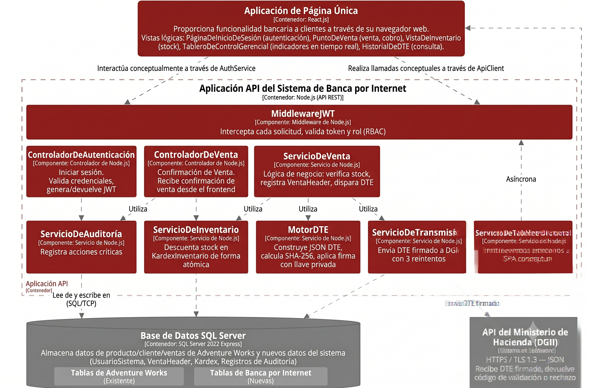

# Módulo Backend

El procesamiento de las métricas se maneja a través de un servicio concurrente escrito en **Go**.

## Endpoints Principales

En la siguiente tabla se detallan las rutas habilitadas en el módulo implementado:

| Endpoint | Método | Descripción |
| -------- | ------ | ----------- |
| `/api/metrics/summary` | `GET` | Retorna un resumen general de las métricas del día. |
| `/api/metrics/export`  | `POST`| Genera un reporte en CSV. |
| `/api/health`          | `GET` | Verifica que el servicio en Go esté activo. |

## Arquitectura
